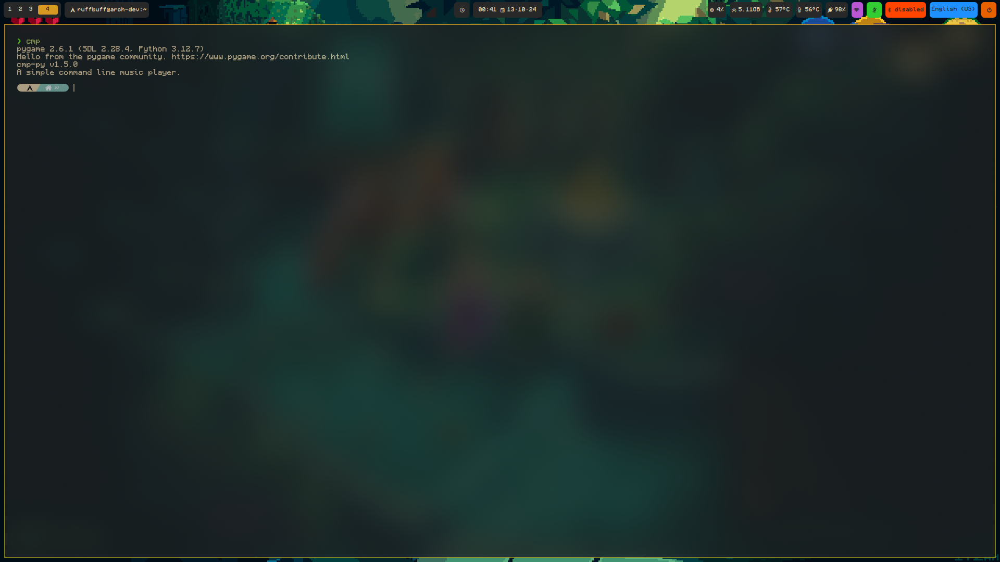
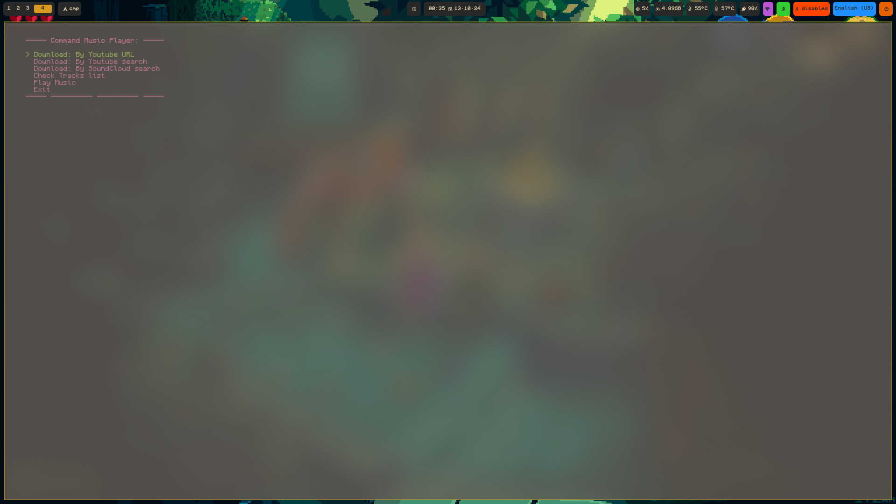
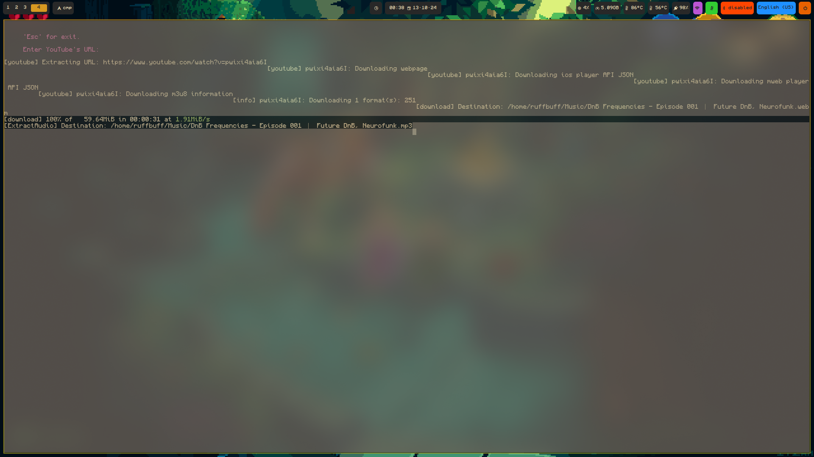
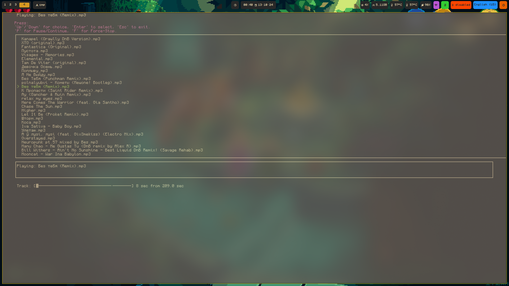

## CMP - Command Music Player ( cmp-py )
A simple command line music player

Developed by:
```shell
▄▄▄  ▄• ▄▌·▄▄▄·▄▄▄ ▄▄▄▄·  ▄• ▄▌·▄▄▄·▄▄▄
▀▄ █·█▪██▌▐▄▄·▐▄▄· ▐█ ▀█▪ █▪██▌▐▄▄·▐▄▄·
▐▀▀▄ █▌▐█▌██▪ ██▪  ▐█▀▀█▄ █▌▐█▌██▪ ██▪ 
▐█•█▌▐█▄█▌██▌.██▌ .██▄▪▐█ ▐█▄█▌██▌.██▌.
.▀  ▀ ▀▀▀ ▀▀▀ ▀▀▀  ·▀▀▀▀   ▀▀▀ ▀▀▀ ▀▀▀ 
```
<br/>
<br/>
<br/>
<br/>
### Installation
1: `git clone https://github.com/ruffbuff/cmp-py`<br/>
2: `cd cmp-py`<br/>
3: `touch .env`, add `API_KEY=YOUR_API_KEY`, then go to `.config/cmp/conf.py` change `MUSIC_PATH` to yours.<br/>
4: `nano ~/.config/cmp/cmp.sh`<br/>
5.0: Then add this `[cmp.sh](.config/cmp/cmp.sh)` bash script, and make it executable.<br/>
(If you use `Kitty` like me, in my `kitty.conf` i have `window_padding_width 15`,so i use `restore_padding` func.<br/>
5.1: `chmod +x ~/.config/cmp/cmp.sh`<br/>
6: Last thing: `cd` to your terminal framework config like `~/.zshrc` for `zsh`,<br/> and find lines with `Helpful aliases`,<br/> add `alias cmp='~/.config/cmp/cmp.sh'`, then `ctrl+o` + `Enter` to save, and `ctrl+x` to exit.<br/>
7: Start your terminal and write `cmp`<br/>
### License
**[CC-BY-SA-4.0](LICENSE)**<br/>
[Link](https://choosealicense.com/licenses/cc-by-sa-4.0/#)
